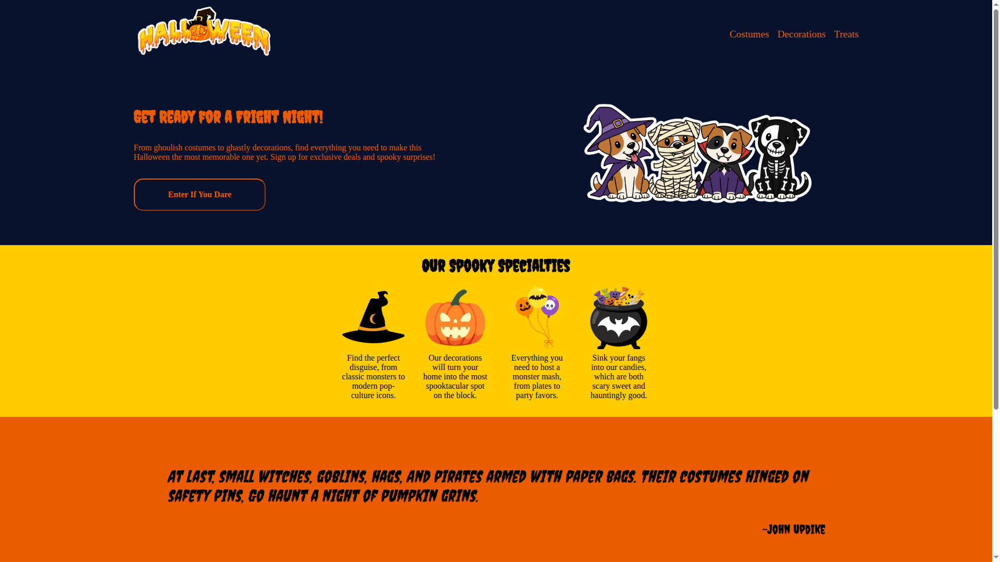

# My Halloween Landing Page Project

This is my take on the Landing Page assignment from The Odin Project's Foundations curriculum. I decided to have a bit of fun with it and went for a Halloween theme\!

**You can check out the live site right here:**
**[https://randommeower.github.io/TheOdinProject_Foundations_LandingPageProject/](https://randommeower.github.io/TheOdinProject_Foundations_LandingPageProject/)**

---

## About This Project

This was the second major project in the curriculum, and the main goal was to really get hands-on with Flexbox. I built the entire page from a design mockup, focusing on structuring the HTML correctly and then bringing it to life with CSS.

Just a heads-up, it's a static page, so the buttons and links are just for show. The real mission was to make a good-looking, responsive layout.

## What I Learned & My Process

Honestly, I'm extremely proud of how this turned out. My biggest goal was to nail the responsiveness, and I spent a lot of time shrinking the screen down and making sure everything looked good on mobile devices. It was a great feeling to see the layout adapt perfectly.

This project was a deep dive into Flexbox for me. There were definitely some tricky moments, but getting all the containers and items to align just right was a huge "aha\!" moment.

I should also mention that while the curriculum encourages you to solve problems with Google (which I did\!), I also used Gemini as a learning tool. It was super helpful for getting unstuck on specific CSS problems and helped me understand the _why_ behind some solutions. It felt less like cheating and more like having a tutor to guide me.

## Credits & Thanks

This wouldn't have been possible without the amazing (and free\!) curriculum from **The Odin Project**.

I also got some great assets from around the web:

- **Color Palette:** [ColorHunt](https://colorhunt.co/)
- **Quote:** [Today.com](https://www.google.com/search?q=https://www.today.com/life/holidays/halloween-quotes-rcna41306)
- **Logo Asset:** [Png Arts](https://www.pngarts.com/)
- **Other Assets:** Created with a little help from [Canva](https://www.canva.com/)
